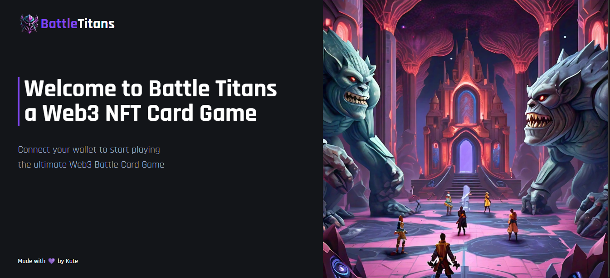

# Online Multiplayer Web3 Card Battle Game

## See App [Demo](https://nft-card-battle-game.vercel.app/)

Register your user, create and join live battles, choose your battleground and battle other players in real-time.

## Pre-requirements

- Core Crypto Wallet
- Avax Fuji faucet (https://guild.xyz/avalanche)

## Stack
- React 18
- Vite
- Tailwind CSS
- Hardhat
- Avalanche Fuji C-Chain testnet
- Core Crypto Wallet
- Vercel

## Run Project Locally
`cd client` folder and run `npm run dev` to start application on `http://localhost:5173`

